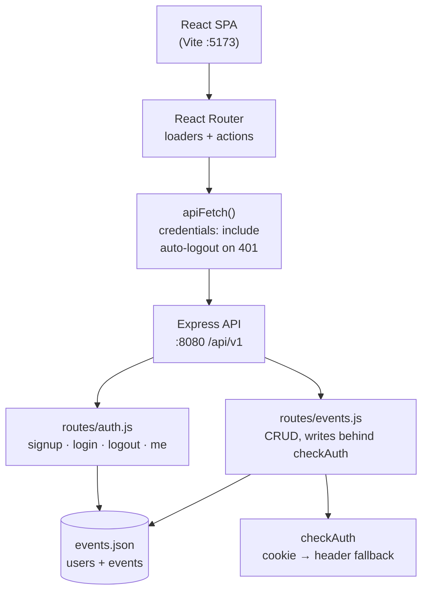
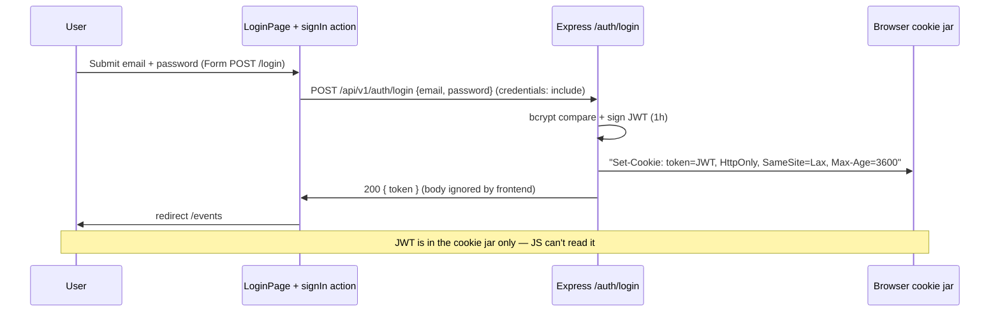
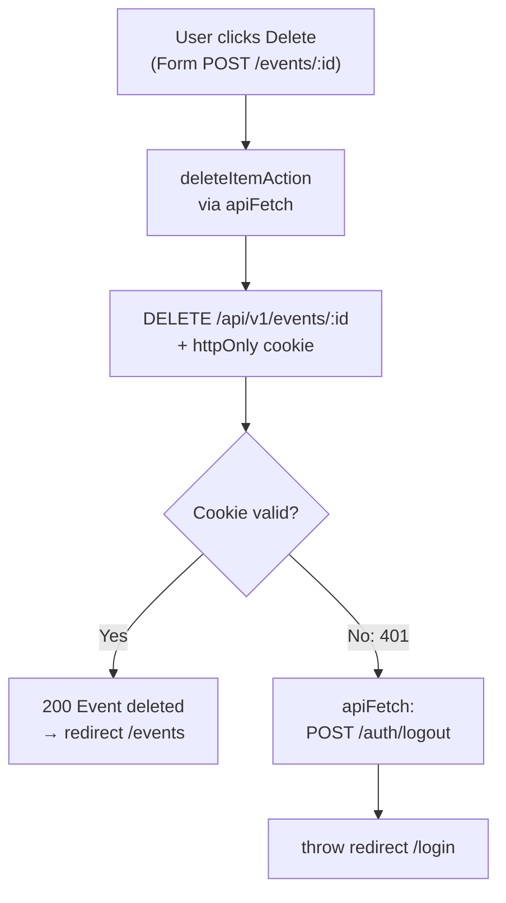
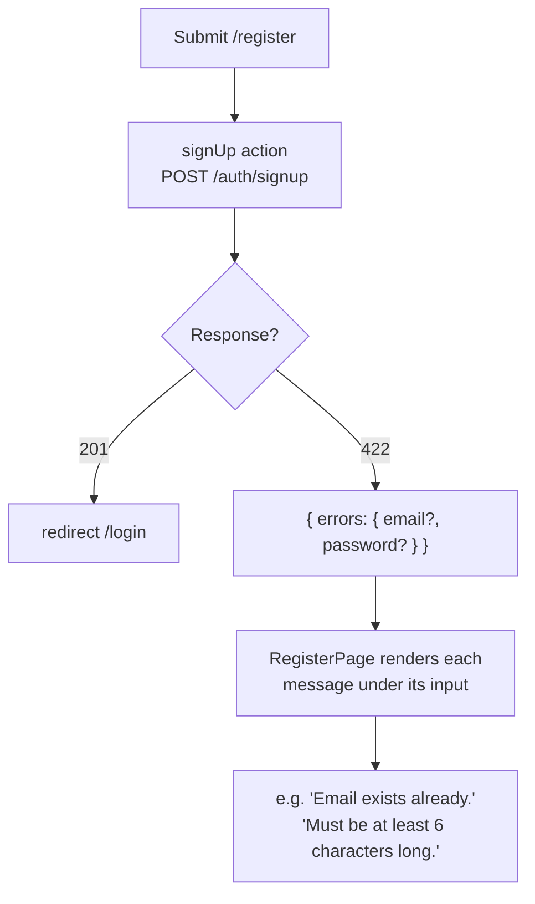
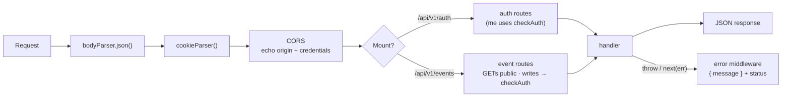

# EventHub — React + Express Event Manager with Cookie Auth

A full-stack practice project (based on Maximilian Schwarzmüller's React course, section 23):
browse events as a guest, then **sign up / log in to create, edit, and delete events**.
Authentication uses a **JWT stored in an httpOnly cookie** — no token ever touches
JavaScript or `localStorage`.

- Frontend: `http://localhost:5173` (Vite dev server)
- Backend: `http://localhost:8080/api/v1` (Express)

---

## ✨ Features

| Area | What you get |
| ---- | ------------ |
| Events | Public list + detail pages, search-free browse with featured cards |
| Auth | Register with per-field errors, login with error banner, logout |
| Dashboard (`/dashboard`) | Signed-in email, total / upcoming / past event counts, latest event, quick actions |
| Session handling | httpOnly `token` cookie, `GET /auth/me` nav state, **auto-logout on 401** |
| Validation | Backend 422 per-field errors surfaced under the right input |
| UX | Dark theme (Tailwind v4), Lucide icons, lazy-loaded routes, smart error page |

---

## 🧰 Tech Stack

**Frontend**

| Tool | Version | Role |
| ---- | ------- | ---- |
| React + React DOM | 19 | UI |
| react-router-dom | 7 | Data router (loaders + actions) |
| TypeScript | 6 | Type safety (`tsc -b`) |
| Vite | 8 (+ `@vitejs/plugin-react`) | Dev server + build |
| Tailwind CSS | 4 (via `@tailwindcss/vite`) | Styling |
| lucide-react | 1.45 | Icons |
| oxlint | 1.81 | Linting |

**Backend** (`backend/`, plain Node + Express)

| Tool | Role |
| ---- | ---- |
| express 4 | REST API under `/api/v1` |
| jsonwebtoken 8 | JWTs (`expiresIn: 1h`) |
| bcryptjs 2 | Password hashing |
| cookie-parser 1 | Reads the httpOnly `token` cookie |
| body-parser 1 | JSON bodies |
| uuid 9 | Event/user ids |

**Storage:** file-based JSON — `backend/events.json` holds both `users` and `events`
(no database to install).

---

## 📁 Project Structure

```
.
├── src/
│   ├── App.tsx                        # createBrowserRouter: routes + loaders + actions
│   ├── main.tsx                       # entry point
│   ├── index.css                      # Tailwind
│   ├── components/
│   │   ├── RootLayout.tsx             # nav (Sign in vs Logout via sessionLoader)
│   │   ├── EventsList.tsx / EventItem.tsx / EventForm.tsx
│   │   ├── EventsNavigation.tsx / Loading.tsx
│   ├── pages/
│   │   ├── HomePage.tsx / EventsPageLoader.tsx / EventDetailPage.tsx
│   │   ├── NewEventPage.tsx / EditEventPage.tsx / OldEventsPage.tsx
│   │   ├── login.tsx / register.tsx / dashboard.tsx / ErrorPage.tsx
│   └── utils/
│       ├── api.ts                     # API_BASE_URL + apiFetch (cookie + auto-logout)
│       ├── auth/
│       │   ├── sign-up.ts             # /register action → per-field errors
│       │   ├── sign-in.ts             # /login action
│       │   └── session.ts             # sessionLoader (/me) + logoutAction
│       └── events functions/
│           ├── eventLoader.ts / fetchOneEvent.ts      # GET loaders
│           └── addEvent.ts / editEventDetails.ts / deleteItem.ts  # mutations
├── backend/
│   ├── app.js                         # middleware, CORS, mounts, error handler, :8080
│   ├── routes/auth.js                 # signup / login / logout / me
│   ├── routes/events.js               # CRUD (GETs public, writes behind checkAuth)
│   ├── util/auth.js                   # JWT create/verify + checkAuth (cookie → header fallback)
│   ├── util/validation.js / util/errors.js
│   ├── data/{event,user}.js + data/util.js  # JSON file access
│   ├── events.json                    # 🗄️ the database
│   └── route.md                       # full API reference
└── .env                               # VITE_API_URL=http://localhost:8080/api/v1
```

---

## 🚀 Getting Started

### Prerequisites

- Node.js 18+ and npm

### 1. Backend (terminal 1)

```bash
cd backend
npm install
node app.js
# → API live at http://localhost:8080/api/v1
```

### 2. Frontend (terminal 2, project root)

```bash
npm install
npm run dev
# → App live at http://localhost:5173
```

### 3. Environment

| File | Variable | Default | Purpose |
| ---- | -------- | ------- | ------- |
| `.env` | `VITE_API_URL` | `http://localhost:8080/api/v1` | Backend base URL (trailing slashes trimmed in `api.ts`) |

> ⚠️ **Port 8080 already in use?** A stale `node app.js` may be squatting on it
> (this bites during development). Find and stop it, then restart:
>
> ```bash
> ss -ltnp | grep 8080        # note the pid
> kill <pid>                  # use the exact PID (no pkill -f, it can match your own shell)
> cd backend && node app.js
> ```

### Scripts

| Command | Where | What |
| ------- | ----- | ---- |
| `npm run dev` | root / `backend/` | Vite dev server / `node app.js` |
| `npm run build` | root | `tsc -b && vite build` |
| `npm run lint` | root | `oxlint` |
| `npm run preview` | root | Preview the production build |

---

## 🔐 Authentication Design

- On **signup/login** the backend creates a JWT (`expiresIn: 1h`) and sets it as an
  **httpOnly cookie**: `token=…; HttpOnly; SameSite=Lax; Max-Age=3600; Path=/`
  (`Secure` is added automatically when `NODE_ENV=production`).
- The token is **also** returned in the JSON body for backward compatibility, but the
  frontend ignores it — nothing is stored in `localStorage`.
- Every frontend request goes through **`apiFetch`** (`src/utils/api.ts`), which sets
  `credentials: "include"` so the browser attaches the cookie.
- `checkAuth` (`backend/util/auth.js`) reads **`req.cookies.token` first**, falling back
  to `Authorization: Bearer <token>`.
- **Nav state:** the root route runs `sessionLoader()` → `GET /auth/me` → `{ isLoggedIn }`,
  consumed via `useRouteLoaderData("root")`. No client-side token checks.
- **Logout:** POST-only `/logout` route → `logoutAction` → backend clears the cookie →
  redirect to `/login`. (Must be a `<Form method="post">` — a plain `<Link>` issues a
  GET, and GETs never run actions.)
- CORS echoes the caller origin with `Access-Control-Allow-Credentials: true`
  (credentialed requests forbid `*`).

Full endpoint details live in [`backend/route.md`](backend/route.md).

---

## 🗺️ Frontend Routes

| Path | Element | Loader | Action | Notes |
| ---- | ------- | ------ | ------ | ----- |
| `/` | HomePage | `sessionLoader` (root) | — | Landing |
| `/events` | EventsPageLoader | `eventsLoader` | — | Public list |
| `/events/new` | NewEventPage | — | `addEvent` | 401 → auto-logout |
| `/events/:id` | EventDetailPage | `fetchOneEvent` | `deleteItemAction` | Delete form posts here |
| `/events/:id/edit` | EditEventPage | `fetchOneEvent` | `editEventDetails` | |
| `/login` | LoginPage | — | `signIn` | Redirects to `/events` |
| `/register` | RegisterPage | — | `signUp` | Per-field errors, redirects to `/login` |
| `/dashboard` | DashboardPage | `dashboardLoader` | — | Protected (redirects to `/login`) |
| `/logout` | — (action only) | — | `logoutAction` | POST-only, no element |

---

## 📊 Diagrams

### 1. System architecture



### 2. Login flow (httpOnly cookie)



### 3. Authenticated mutation + auto-logout on expiry



### 4. Registration validation flow



### 5. Backend request lifecycle



---

## 🧪 Quick Smoke Test (backend)

```bash
cd backend && node app.js & sleep 2

# signup sets the cookie
curl -i -X POST http://localhost:8080/api/v1/auth/signup \
  -H 'Content-Type: application/json' \
  -d '{"email":"me@example.com","password":"secret123"}'   # → 201 + Set-Cookie: token=...; HttpOnly

# session check with the cookie (login first to fill the jar if needed)
curl -c jar.txt -X POST http://localhost:8080/api/v1/auth/login \
  -H 'Content-Type: application/json' \
  -d '{"email":"me@example.com","password":"secret123"}'
curl -b jar.txt http://localhost:8080/api/v1/auth/me        # → {"email":"me@example.com"}

# protected write with cookie only (no Authorization header)
curl -b jar.txt -X POST http://localhost:8080/api/v1/events \
  -H 'Content-Type: application/json' \
  -d '{"title":"Demo","description":"smoke test","date":"2026-10-01","image":"https://example.com/i.png"}'  # → 201

# logged out → 401
curl http://localhost:8080/api/v1/auth/me                   # → 401
```

---

## 📝 Notes & Gotchas

- **React Router rule of thumb:** Links navigate (GET → loaders), Forms submit
  (POST/etc → actions). Logout and delete must be forms, not links.
- **Forms need `type="submit"`** — `type="button"` never submits (this once broke registration).
- `<Form action>` is a **client route path**, not a backend URL — posting a form to
  `/api/v1/...` bypasses the route action entirely.
- `apiFetch` skips auto-logout for `/auth/*` so failed logins show their error
  message instead of redirect-looping.
- `sessionLoader` never throws — public pages stay public even with the backend down.
